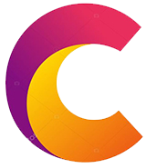

<a name="readme-top"></a>
<div align="center">
  
  <br/>

  <h3><b>Portfolio Microverse Project</b></h3>

</div>

<!-- TABLE OF CONTENTS -->

# 📗 Table of Contents

- [📖 About the Project](#about-project)
  - [🛠 Built With](#built-with)
    - [Tech Stack](#tech-stack)
    - [Key Features](#key-features)
  - [🚀 Live Demo](#live-demo)
  - [🚀 Project Presentation](#project-presentation)
- [💻 Getting Started](#getting-started)
  - [Setup](#setup)
  - [Prerequisites](#prerequisites)
  - [Install](#install)
  - [Usage](#usage)
  - [Run tests](#run-tests)
  - [Deployment](#deployment)
- [👥 Authors](#authors)
- [🔭 Future Features](#future-features)
- [🤝 Contributing](#contributing)
- [⭐️ Show your support](#support)
- [🙏 Acknowledgements](#acknowledgements)
- [❓ FAQ (OPTIONAL)](#faq)
- [📝 License](#license)

<!-- PROJECT DESCRIPTION -->

# 📖 [Uduekwe Christopher Chukwudi] <a name="about-project"></a>

> This project was created as part of Microverse week one tasks.
It gives the student an opportunity to play around with HTML, CSS, and Github.
It also allows the student to showcase what they can do to the future employee.

**[Portfolio Microverse]** is a portfolio website

## 🛠 Built With <a name="built-with"></a>

### Tech Stack <a name="tech-stack"></a>

> The tech stack used in this project include CSS, HTML5, and Github.

<details>
  <summary>Version Control</summary>
  <ul>
    <li><a href="https://github.com/">GitHub</a></li>
  </ul>
</details>

<details>
  <summary>Client</summary>
  <ul>
    <li><a href="https://www.w3.org/Style/CSS/Overview.en.html">CSS</a></li>
    <li><a href="https://html.com/">HTML</a></li>
  </ul>
</details>

<!-- Features -->

### Key Features <a name="key-features"></a>

> This project contain the features listed below.

- **[HTML Display Property]**
- **[CSS Flex/Grid]**
- **[CSS Mobile First Design Approch]**
- **[Git Branch]**
- **[.gitignore file]**

<p align="right">(<a href="#readme-top">back to top</a>)</p>

<!-- LIVE DEMO -->

## 🚀 Live Demo <a name="live-demo"></a>

> This Project is deployed at https://chudisoft.github.io/Portfolio-Microverse/

<!-- - [Live Demo Link](https://google.com) -->

<p align="right">(<a href="#readme-top">back to top</a>)</p>

<!-- Project Presentation -->

## 🚀 Project Presentation <a name="project-presentation"></a>

> Feel free to watch the project presentation at [loom](https://www.loom.com/share/a676e26753bc42259b94e2797629015e)

<!-- - [Loom](https://www.loom.com/share/a676e26753bc42259b94e2797629015e) -->

<p align="right">(<a href="#readme-top">back to top</a>)</p>

<!-- GETTING STARTED -->

## 💻 Getting Started <a name="getting-started"></a>

To get a local copy up and running, follow these steps.

### Prerequisites

In order to run this project you need:


### Setup

Clone this repository to your desired folder:

```sh
  git clone git@github.com:chudisoft/portfolio-microverse.git
  cd portfolio-microverse
  code .
```
-

### Install

This project doesn't require installation. 


### Usage

To run the project, execute the following command:
Open index.html with a browser (Chrome, Firefox, Opera, Safari, or Edge)


### Run tests

For now no test is implemented.

### Deployment

You can deploy this project using:
Copying/uploading the project folder's contents to the root of 
your server.

<p align="right">(<a href="#readme-top">back to top</a>)</p>

<!-- AUTHORS -->

## 👥 Authors <a name="authors"></a>

> The collaborators of this project include:

👤 **Author1**

- GitHub: [@githubhandle](https://github.com/chudisoft)
- Twitter: [@twitterhandle](https://twitter.com/chrisuduekwe)
- LinkedIn: [LinkedIn](https://linkedin.com/in/christopher-uduekwe)

<p align="right">(<a href="#readme-top">back to top</a>)</p>

<!-- FUTURE FEATURES -->

## 🔭 Future Features <a name="future-features"></a>

> Features I will add to the project are:

- [ ] **[About Page]**
- [ ] **[Contact Page]**
- [ ] **[Past Samples]**

<p align="right">(<a href="#readme-top">back to top</a>)</p>

<!-- CONTRIBUTING -->

## 🤝 Contributing <a name="contributing"></a>

Contributions, issues, and feature requests are welcome!

Feel free to check the [issues page](../../issues/).

<p align="right">(<a href="#readme-top">back to top</a>)</p>

<!-- SUPPORT -->

## ⭐️ Show your support <a name="support"></a>

> Readers are encouraged to support this project by contributing.

If you like this project, feel free to use it, leave a comment and
follow me for update.

<p align="right">(<a href="#readme-top">back to top</a>)</p>

<!-- ACKNOWLEDGEMENTS -->

## 🙏 Acknowledgments <a name="acknowledgements"></a>

I would like to thank microverse for this __wonderful__ opportunity.

<p align="right">(<a href="#readme-top">back to top</a>)</p>

<!-- FAQ (optional) -->

## ❓ FAQ (OPTIONAL) <a name="faq"></a>

> 2 questions new developers would ask when they decide to use this project.

- **[What languages where used?]**

  - [Html5, and CSS]

- **[What git control system was used?]**

  - [Github]

<p align="right">(<a href="#readme-top">back to top</a>)</p>

<!-- LICENSE -->

## 📝 License <a name="license"></a>

This project is [MIT](./MIT.md) licensed.

<p align="right">(<a href="#readme-top">back to top</a>)</p>
